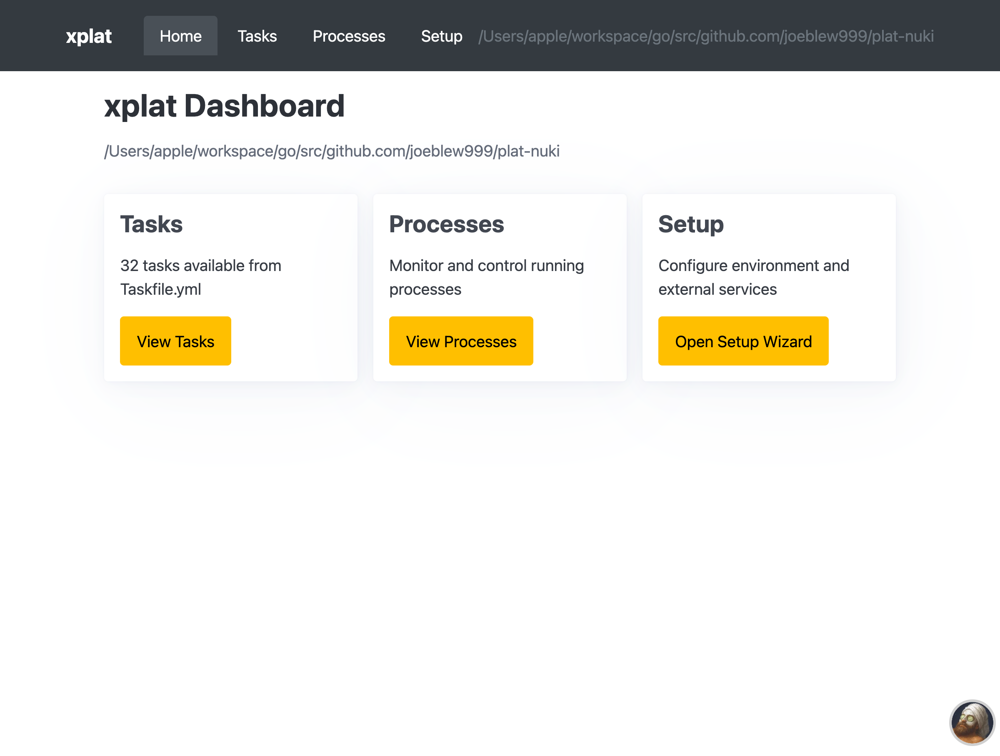
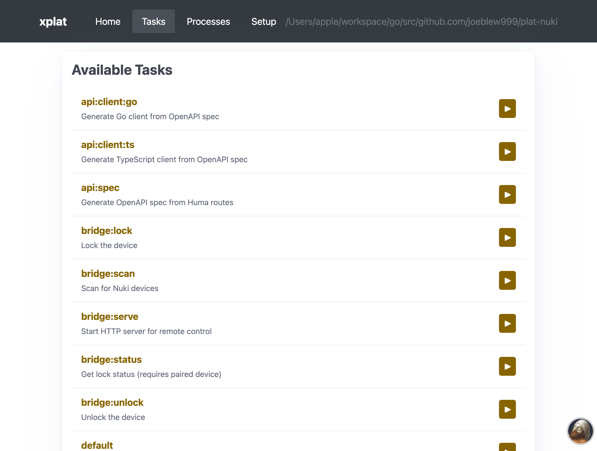
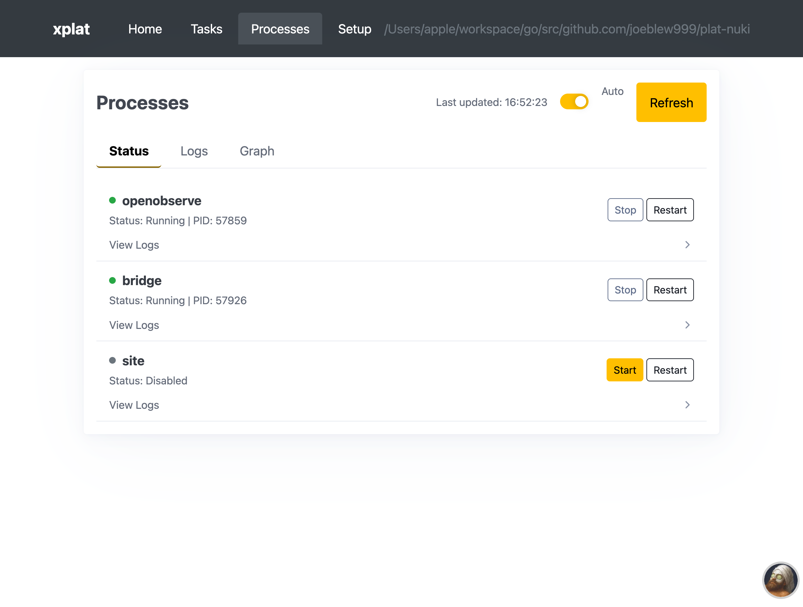
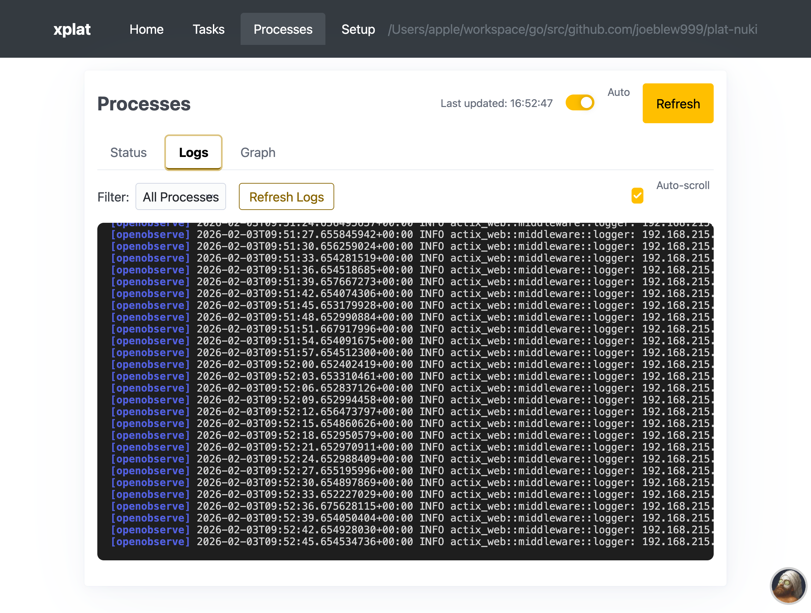

# plat-nuki

https://joeblew999.github.io/plat-nuki/

Code and docs for Nuki smart locks.

Needs testing with real sample lock, and integration into xplat ecosystem.

## Run with Xplat

```sh
xplat up
```










## Acknowledgements

This project builds on the excellent work of:

- [nuki-io/nuki-cli](https://github.com/nuki-io/nuki-cli) - Official Nuki CLI and BLE protocol implementation
- [ogen-go/ogen](https://github.com/ogen-go/ogen) - OpenAPI v3 code generator for Go
- [danielgtaylor/huma](https://github.com/danielgtaylor/huma) - Modern Go REST/HTTP API framework
- [tinygo-org/bluetooth](https://github.com/tinygo-org/bluetooth) - Cross-platform Bluetooth API for Go


