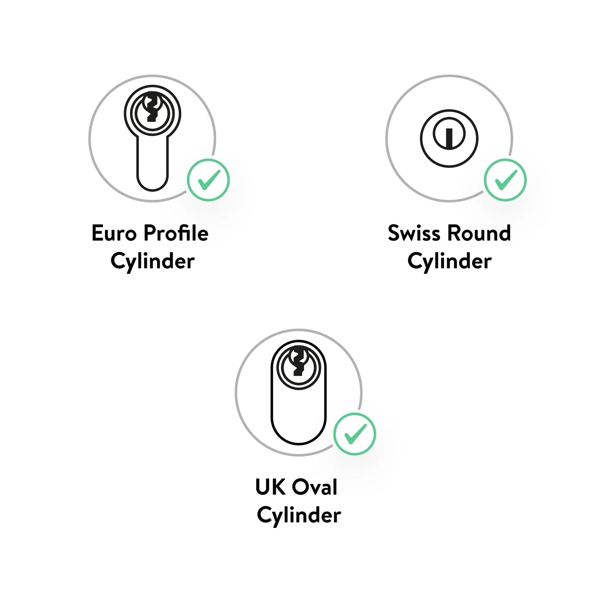
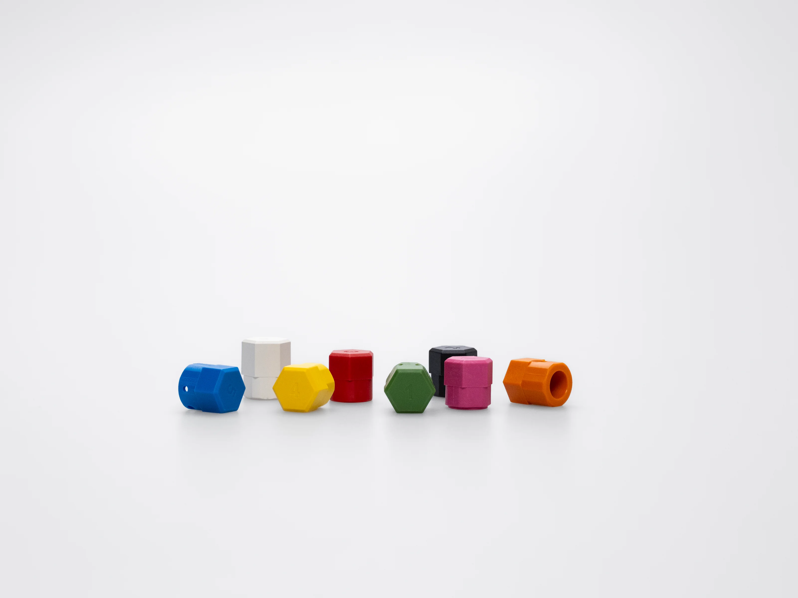
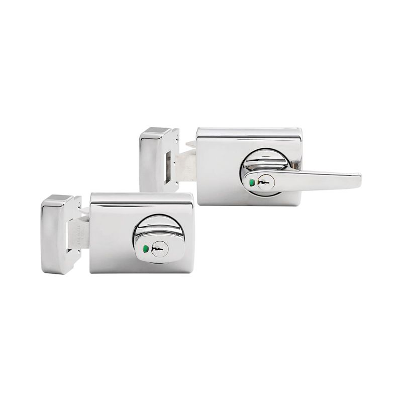

# Asia & Australia Market Analysis

**Purpose**: Document Nuki compatibility gaps and solutions for Asia-Pacific deployment.

> **Meeting Prep**: This document identifies what Nuki currently supports and what gaps exist for the Asia/Australia market. Use this to discuss solutions with Nuki.

---

## Bottom Line: You're Not Screwed

**Southeast Asia (Singapore, Malaysia, HK, Thailand)** → ✅ Standard Nuki Pro works. These markets use euro profile cylinders. Stock Yellow (Dormakaba) and Magenta (Yale) adapters and you're covered for most installations.

**Australia** → ⚠️ Partial coverage. Modern apartments with euro cylinders work fine. The gap is older houses with Lockwood 001 rim locks (~60% of residential) - these need lock replacement or alternative products. Target the 25-35% that ARE compatible first.

**Your Opportunity**: You're not behind - you're ahead. Most people entering this market don't know about these gaps. You can:
1. Be the **APAC deployment partner** Nuki doesn't have yet
2. Design the **Lockwood oval adapter** the community needs
3. Create **regional guides** that don't exist

**Your Background**: Building Architect and Systems Architect with global experience. You understand:
- Building specifications and door hardware standards across regions
- Systems integration (smart locks into building management, access control)
- Large-scale deployment logistics
- The gap between European product design and APAC market realities

**This documentation gives you leverage in the Nuki meeting.**

---

## Executive Summary

| Market | Compatibility | Gap Size | Solution Complexity |
|--------|---------------|----------|---------------------|
| **Singapore** | ✅ Good | Small | Standard adapters |
| **Malaysia** | ✅ Good | Small | Standard adapters |
| **Hong Kong** | ✅ Good | Small | Standard adapters |
| **Thailand** | ✅ Good | Small | Standard adapters |
| **Australia** | ⚠️ Partial | **LARGE** | Lock replacement or custom adapter |
| **New Zealand** | ⚠️ Partial | Medium | Same as Australia |
| **Japan** | ❌ Poor | Very Large | Different product needed |
| **South Korea** | ❌ N/A | N/A | Market already digital |
| **Philippines** | ⚠️ Mixed | Medium | Mixed lock types |
| **Indonesia** | ⚠️ Mixed | Medium | Mixed lock types |

---

## Southeast Asia: ✅ GOOD NEWS

### Why It Works

Southeast Asia widely uses **euro profile cylinders** in mortise locks.

**This is what a euro cylinder looks like (the drop shape):**



Common in:
- HDB flats (Singapore)
- Condominiums (all markets)
- Commercial buildings
- Modern residential developments

**The standard Nuki Smart Lock Pro should work with existing adapters.**



### Common Cylinder Brands in SEA

| Brand | Origin | Nuki Adapter | Notes |
|-------|--------|--------------|-------|
| **Dormakaba** | Germany | Yellow | Very common in commercial |
| **Häfele** | Germany | Check brand | Common in residential |
| **Yale** | International | Magenta | Widely available |
| **ISEO** | Italy | Black | Building projects |
| **Mul-T-Lock** | Israel | Test fit | High-security option |

### Recommended Action

1. **Test before bulk deployment** - Confirm adapter fit for specific buildings
2. **Stock Yellow (Dormakaba) and Magenta (Yale) adapters** - Most common brands
3. **Identify local cylinder brands** - May need custom 3D adapters for obscure brands

### Potential Gaps

| Issue | Where | Solution |
|-------|-------|----------|
| Local/regional cylinder brands | All markets | 3D print custom adapters |
| Unusual knob dimensions | Older buildings | Measure and test |
| Non-euro cylinders | Older HDB | May need cylinder replacement |

---

## Australia: ⚠️ SIGNIFICANT GAP

### The Problem

Australia's most common residential lock is the **Lockwood 001**, which is fundamentally incompatible with Nuki.

**This is what a Lockwood 001 looks like:**



It's a **rim lock** (surface-mounted box), NOT a cylinder. Nuki cannot attach to this.

```
┌─────────────────────────────────────────────────────────┐
│              LOCKWOOD 001 (AUSTRALIA)                    │
├─────────────────────────────────────────────────────────┤
│                                                          │
│   OUTSIDE               │               INSIDE           │
│                         │                                │
│   ┌─────────────┐      │      ┌─────────────────────┐  │
│   │             │      │      │                     │  │
│   │   KEYHOLE   │      │      │   RIM-MOUNTED       │  │
│   │      ◉      │◄─────┼─────►│   DEADLATCH         │  │
│   │             │      │      │                     │  │
│   └─────────────┘      │      │  ┌──────────────┐   │  │
│                        │      │  │   SNIB       │   │  │
│                        │      │  │  (thumb turn)│   │  │
│   Surface mounted      │      │  └──────────────┘   │  │
│   on door face         │      │                     │  │
│                        │      └─────────────────────┘  │
│                        │                                │
│    NOT a cylinder!     │       NOT a thumbturn Nuki    │
│                        │       can grip!                │
│                        │                                │
└─────────────────────────────────────────────────────────┘
```

### Why Lockwood 001 Won't Work

| Issue | Explanation |
|-------|-------------|
| **Not a cylinder** | Rim lock, not euro profile |
| **Surface mounted** | Attached to inside door face, not in door |
| **Snib mechanism** | Different from thumbturn |
| **No adapter possible** | Form factor is completely different |

### Australia Lock Type Breakdown

| Lock Type | % of Residential | Nuki Compatible? |
|-----------|------------------|------------------|
| **Lockwood 001** | ~60% | ❌ NO |
| **Euro Cylinder** | ~25% | ✅ YES (Smart Lock Pro) |
| **Oval Cylinder** | ~10% | ⚠️ With custom adapter |
| **US Deadbolt** | ~5% | ✅ YES (Smart Lock US) |

### Solutions for Australia

#### Option 1: Target Euro Cylinder Doors Only
- Modern apartments often have euro cylinders
- New construction increasingly uses euro profile
- **Limitation**: Excludes majority of existing homes

#### Option 2: Lock Replacement
Replace Lockwood 001 with a euro cylinder mortise lock:

```
Before:                    After:
┌────────────┐            ┌────────────┐
│ Lockwood   │            │  Mortise   │
│    001     │    →→→     │   Lock     │
│ (rim lock) │            │ (euro cyl) │
└────────────┘            └────────────┘
                          + Nuki Pro
```

**Cost**: $200-400 AUD for lock + installation
**Pro**: Full Nuki functionality
**Con**: Expensive, invasive, may not suit renters

#### Option 3: Custom Adapter for Oval Cylinders
Some Australian doors use oval cylinders (Lockwood 5-pin):

```
┌─────────────────────────────────────────┐
│         LOCKWOOD OVAL CYLINDER           │
├─────────────────────────────────────────┤
│                                          │
│    Euro Profile      Oval Profile        │
│    ┌─────────┐       ╭─────────╮        │
│    │         │       │         │        │
│    │   ◉     │  vs   │    ◉    │        │
│    │         │       │         │        │
│    └────╮╭───┘       ╰─────────╯        │
│         ││                               │
│    Drop-shaped       Fully oval          │
│                                          │
└─────────────────────────────────────────┘
```

**Opportunity**: 3D print an adapter for oval cylinder knobs
**Status**: No existing design - **DESIGN NEEDED**
**Difficulty**: Medium - need to measure Lockwood oval dimensions

#### Option 4: Alternative Products
For Lockwood 001 doors, recommend alternatives:
- **August WiFi Smart Lock** - Works with existing deadbolts
- **Level Lock** - Invisible, works inside existing lock
- **Tedee** - European but may fit some AU doors

### Adapter Design Priority: Lockwood Oval

If we want to support more Australian doors, we should design a custom adapter:

**Measurements Needed**:
1. Lockwood oval cylinder outer diameter
2. Inner bore diameter
3. Knob height
4. Key cam dimensions

**Where to Find**:
- Australian locksmith supply
- Lockwood product specs
- Physical measurement of installed cylinder

---

## Japan: ❌ NOT COMPATIBLE

### Why Japan is Different

Japan uses **MIWA LA-type mortise locks** which are completely different from US/EU systems:

| Feature | Euro/US | MIWA (Japan) |
|---------|---------|--------------|
| Cylinder type | Drop/rectangular | Pin tumbler specific |
| Mounting | Inside door | Recessed in door edge |
| Standard | DIN/ANSI | JIS |
| Modularity | Replace cylinder | Entire lock unit |

### MIWA Lock Diagram

```
┌─────────────────────────────────────────┐
│            MIWA LA-TYPE LOCK             │
├─────────────────────────────────────────┤
│                                          │
│      DOOR EDGE         DOOR FACE         │
│     ┌────────┐        ┌──────────┐      │
│     │        │        │          │      │
│     │ MORTISE├────────┤  KEYHOLE │      │
│     │  BODY  │        │    ◉     │      │
│     │        │        │          │      │
│     │   ●────┼────────┼────●     │      │
│     │  bolts │        │  handle  │      │
│     │        │        │          │      │
│     └────────┘        └──────────┘      │
│                                          │
│    Completely different form factor!     │
│    No adapter possible.                  │
│                                          │
└─────────────────────────────────────────┘
```

### Japan Solutions

| Option | Feasibility | Notes |
|--------|-------------|-------|
| Nuki adapter | ❌ Not possible | Form factor incompatible |
| Lock replacement | ⚠️ Difficult | Japanese doors often custom-fitted |
| Partner with local brand | ✅ Best option | Qrio, Sesame, MIWA smart locks |
| Skip market | Consider | Digital lock adoption already growing |

### Local Alternatives in Japan

| Brand | Type | Notes |
|-------|------|-------|
| **Qrio** | Smart lock | Japanese startup, MIWA compatible |
| **Sesame** | Adapter style | Works with existing locks |
| **MIWA Smart** | OEM | MIWA's own smart lock |

---

## South Korea: N/A

South Korea has already transitioned to digital locks as the default:
- Keypad entry standard in apartments
- Fingerprint/card common
- Push-pull handles dominant
- **No market for retrofit smart locks**

---

## Recommendations for Nuki Meeting

### Questions to Ask Nuki

1. **SEA Market Support**
   - Do you have a distribution partner in Singapore/Malaysia?
   - What's the warranty/support situation for APAC?
   - Can we get test units with full adapter set?

2. **Australia Strategy**
   - Are you aware of the Lockwood 001 problem?
   - Any plans for Australian-specific product?
   - Would you support 3D printed adapter designs?

3. **Volume/Partnership**
   - What's the minimum order for commercial deployment?
   - Can we get adapters in bulk?
   - White-label or co-branding options?

### What We Can Offer Nuki

1. **Market Testing**
   - Test units in Singapore, Malaysia, Australia
   - Document which adapters work with local cylinders
   - Report on installation success rate

2. **Adapter Development**
   - Design and test Lockwood oval adapter
   - Create adapter for common SEA local brands
   - Share designs on Printables/Cults3D (with Nuki credit)

3. **Documentation**
   - Translate installation guides
   - Create region-specific compatibility guides
   - Support local installers

### Proposed Solution Matrix

| Market | Solution | Our Role | Nuki Role |
|--------|----------|----------|-----------|
| **Singapore** | Standard Pro + adapters | Test & deploy | Supply units |
| **Malaysia** | Standard Pro + adapters | Test & deploy | Supply units |
| **Australia (euro)** | Standard Pro | Target euro doors | Supply units |
| **Australia (oval)** | Custom adapter | Design & print | Approve design |
| **Australia (Lockwood 001)** | Lock replacement OR alternative | Partner with locksmith | None (out of scope) |
| **Japan** | Partner/skip | Identify local partners | None |

---

## Appendix: Adapter Inventory Checklist

### For SEA Deployment

| Adapter | Color | Qty to Stock | Fits |
|---------|-------|--------------|------|
| Dormakaba | Yellow | 50% | Commercial buildings |
| Yale | Magenta | 30% | Residential |
| ISEO | Black | 10% | Building projects |
| Spares | Mixed | 10% | Unknown cylinders |

### For Australia Deployment

| Need | Status | Action |
|------|--------|--------|
| Euro cylinder adapter | ✅ Available | Use standard Nuki adapters |
| Oval cylinder adapter | ❌ Not available | Design and 3D print |
| Lockwood 001 solution | ❌ Not possible | Lock replacement or alternative product |

---

## References

- [Door Lock Types](../door-lock-types/) - Full technical guide
- [Official Adapters](./) - Nuki adapter reference
- [3D Models](3d/) - Printable adapter sources
- [Lockwood Product Catalog](https://www.assaabloyopeningsolutions.com.au/lockwood) - Australian lock specs

---

*Last Updated: January 2026*
*Status: Meeting prep document*
