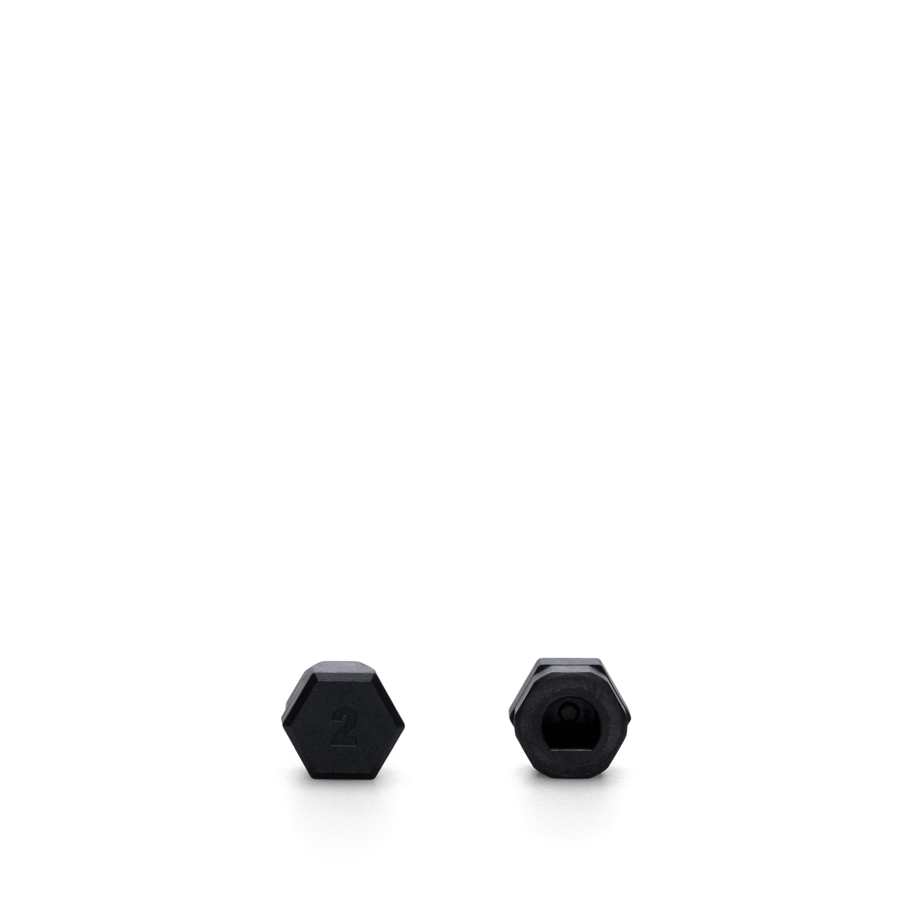
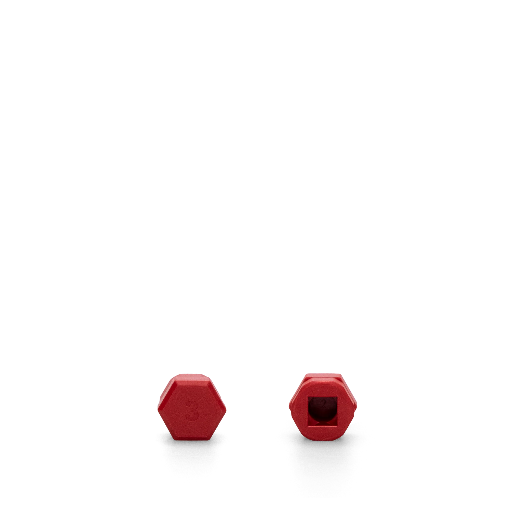

# Nuki Adapters Guide

Adapters connect the Nuki Smart Lock to your door's cylinder. Different regions and manufacturers use different cylinder types, so adapters bridge the gap.

> **TL;DR**: Check your cylinder brand → find the matching adapter → install Nuki.

## Quick Reference

### Do I Need an Adapter?

```
What Nuki model do you have?
            │
    ┌───────┴───────┐
    ▼               ▼
Smart Lock (US)   Smart Lock Pro (EU)
    │                    │
    ▼                    ▼
3 adapters           Need to buy
INCLUDED             separately
    │                    │
    ▼                    ▼
Fits most US        Check your
deadbolts           cylinder brand
```

---

## Official Nuki Adapters (EU)

Nuki sells **8 color-coded adapters** for European knob cylinders. Each fits specific manufacturer brands.

### Visual Guide

| Color | Image | Fits These Brands |
|-------|-------|-------------------|
| **Black** |  | Abus, CISA, Bricard, AXA, ISEO |
| **Green** |  | CES, EVVA |
| **Blue** |  | DOM, Winkhaus |
| **Yellow** |  | Dormakaba (Kaba) |
| **Red** |  | KESO |
| **White** |  | Nemef |
| **Magenta** |  | Yale, M&C |
| **Orange** |  | Mauer |

### Where to Buy

- [Nuki Shop - Adapters](https://nuki.io/en-at/products/spare-parts/adapter-smart-locks)
- Price: ~€10 each

---

## US Adapters (Included)

The **Smart Lock (US)** includes 3 adapters in the box for different tailpiece shapes:

```
┌─────────────────────────────────────────────────────┐
│              US DEADBOLT ADAPTERS                    │
├─────────────────────────────────────────────────────┤
│                                                      │
│   Adapter 1        Adapter 2        Adapter 3       │
│   ┌───────┐       ┌───────┐       ┌───────┐        │
│   │       │       │       │       │       │        │
│   │  ▢    │       │  ◗◖   │       │  ═    │        │
│   │       │       │       │       │       │        │
│   └───────┘       └───────┘       └───────┘        │
│    SQUARE          D-SHAPE         SLOTTED         │
│                                                      │
│   Schlage         Most US          Older           │
│   some Kwikset    brands           locks           │
│                                                      │
└─────────────────────────────────────────────────────┘
```

### Which One Do I Use?

1. Remove your deadbolt's inside cover
2. Look at the tailpiece shape
3. Match to the adapter above
4. If none fit, you may need a 3D printed adapter

---

## How Adapters Work

### Anatomy of the Connection

```
┌─────────────────────────────────────────────────────┐
│                                                      │
│            NUKI SMART LOCK                          │
│          ┌─────────────────┐                        │
│          │    [MOTOR]      │                        │
│          │       │         │                        │
│          │       ▼         │                        │
│          │  ┌─────────┐    │                        │
│          │  │ ADAPTER │◄───┼── Connects Nuki       │
│          │  │ SOCKET  │    │   to cylinder         │
│          │  └────┬────┘    │                        │
│          └───────┼─────────┘                        │
│                  │                                   │
│                  ▼                                   │
│          ┌─────────────┐                            │
│          │   ADAPTER   │◄── Color-coded piece      │
│          │  (colored)  │    that grips the         │
│          │             │    cylinder knob          │
│          └──────┬──────┘                            │
│                 │                                    │
│                 ▼                                    │
│          ┌─────────────┐                            │
│          │  CYLINDER   │◄── Your existing          │
│          │    KNOB     │    door cylinder          │
│          └─────────────┘                            │
│                 │                                    │
│                 ▼                                    │
│          [LOCK MECHANISM]                           │
│                                                      │
└─────────────────────────────────────────────────────┘
```

### Why Different Adapters?

Each cylinder manufacturer uses slightly different knob dimensions:

```
┌──────────────────────────────────────────────────────┐
│            KNOB CYLINDER VARIATIONS                   │
├──────────────────────────────────────────────────────┤
│                                                       │
│    ABUS          EVVA          DOM          YALE     │
│   ┌────┐       ┌──────┐      ┌────┐       ┌────┐    │
│   │    │       │      │      │    │       │    │    │
│   │ ●  │       │  ●   │      │ ●  │       │ ●  │    │
│   │    │       │      │      │    │       │    │    │
│   └────┘       └──────┘      └────┘       └────┘    │
│    24mm         26mm          25mm         23mm      │
│                                                       │
│   Black         Green         Blue        Magenta    │
│   adapter       adapter       adapter     adapter    │
│                                                       │
└──────────────────────────────────────────────────────┘
```

---

## Regional Adapter Guide

### By Country

| Region | Lock Type | Adapter Needed | Status |
|--------|-----------|----------------|--------|
| **USA/Canada** | Deadbolt | 3 included | ✅ Covered |
| **Germany** | Euro cylinder | By brand (see chart) | ✅ Covered |
| **UK** | Euro cylinder | By brand (see chart) | ✅ Covered |
| **Scandinavia** | Oval cylinder | Ultra Nordics model | ✅ Covered |
| **Australia** | Lockwood/Oval | ⚠️ May need custom | 🖨️ Gap |
| **Singapore** | Euro cylinder | By brand (Dormakaba common) | ✅ Covered |
| **Malaysia** | Euro cylinder | By brand (Häfele common) | ✅ Covered |
| **Japan** | MIWA mortise | ❌ Not compatible | ❌ No solution |

### Find Your Cylinder Brand

**On the cylinder itself** - look for stamped text:
```
┌─────────────────────────────────────┐
│                                     │
│          ┌─────────────┐            │
│          │   DOM       │◄── Brand   │
│          │   Germany   │    name    │
│          │             │            │
│          │     ●       │            │
│          │             │            │
│          └─────────────┘            │
│                                     │
└─────────────────────────────────────┘
```

**On your key** - often stamped on the bow:
```
        ┌─────┐
        │EVVA │◄── Brand on key
        └──┬──┘
           │
           │
        ───┴───
```

---

## When Stock Adapters Don't Fit

### Common Problems

| Problem | Symptom | Solution |
|---------|---------|----------|
| **Wrong size** | Adapter is loose/tight | Try different adapter or 3D print |
| **Wrong shape** | Won't grip at all | 3D print custom adapter |
| **No matching brand** | Brand not in Nuki's list | 3D print custom adapter |
| **Knob too big** | Won't fit in Nuki | May not be compatible |

### 3D Printed Solutions

See [3d/README.md](3d/) for printable adapters:

| Gap | Solution | Link |
|-----|----------|------|
| Abus door knob | Custom adapter | [MakerWorld](https://makerworld.com/en/models/1373160) |
| EVVA knob | Gen 5 mount | [Printables](https://www.printables.com/model/1264912) |
| Better grip | Spacer plate | [Printables](https://www.printables.com/model/379910) |
| Various sizes | Multi-size set | [Cults3D](https://cults3d.com/en/tags/nuki) |

### Design Your Own

See [3d/README.md](3d/) for design guidelines.

---

## Troubleshooting

### Adapter Keeps Slipping

1. **Check alignment** - Adapter should be fully seated
2. **Try different adapter** - Might be wrong size
3. **Add spacer** - [3D print spacer](https://www.printables.com/model/379910)
4. **Clean surfaces** - Remove any debris

### Motor Strain / Grinding

1. **Adapter too tight** - Try looser fit
2. **Misalignment** - Reinstall and center
3. **Cylinder binding** - Check if lock itself is stiff

### Won't Turn Full Rotation

1. **Wrong adapter** - Needs different shape
2. **Obstruction** - Check for debris
3. **Cylinder issue** - Test with manual key first

---

## Files in This Folder

```
adapters/
├── README.md           # This file
├── images/             # Adapter product photos
│   ├── adapter-black-abus.webp
│   ├── adapter-green-evva.webp
│   ├── adapter-blue-dom.webp
│   ├── adapter-yellow-dormakaba.webp
│   ├── adapter-red-keso.webp
│   ├── adapter-white-nemef.webp
│   ├── adapter-magenta-yale.webp
│   └── adapter-orange-mauer.webp
├── diagrams/           # Technical diagrams
└── 3d/                 # 3D printable models
    ├── README.md
    ├── adapters/
    ├── spacers/
    └── accessories/
```

---

## See Also

- [Adapter Types](types/) - Detailed guide for each adapter type (8 EU colors + US + Nordic + Custom)
- [Country Guides](countries/) - Per-country compatibility, adapters, and buying guides (20+ countries)
- [Door Lock Types](../door-lock-types/) - Understanding different lock standards
- [Visual Diagrams](diagrams/) - Photos showing what all this jargon actually means
- [3D Models](3d/) - Printable adapters and accessories
- [Asia/Australia Gaps](./ASIA-AUSTRALIA-GAPS/) - Market analysis and solutions for APAC deployment
- [Nuki API](../nuki-api/) - Software integration
