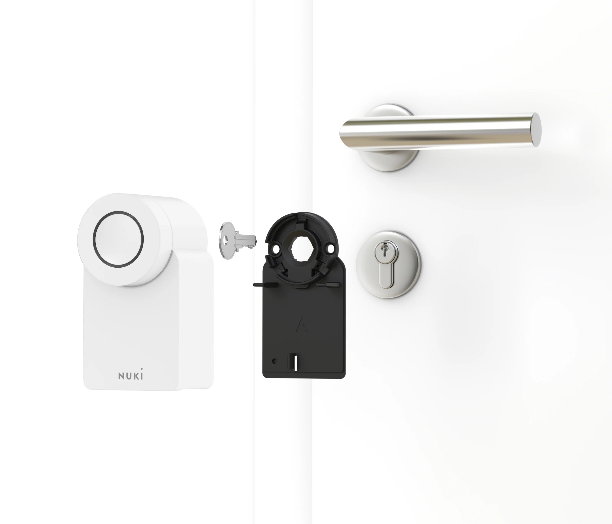
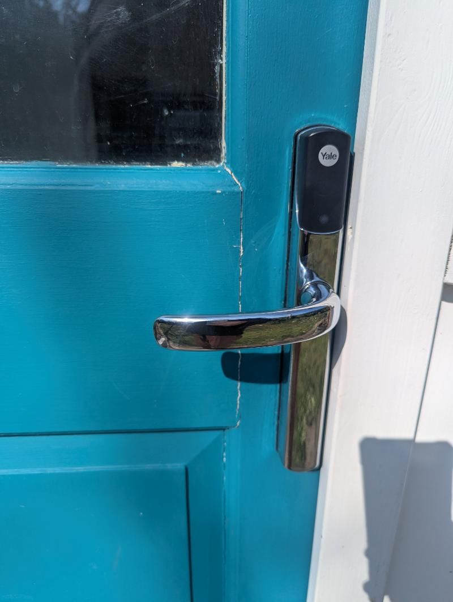
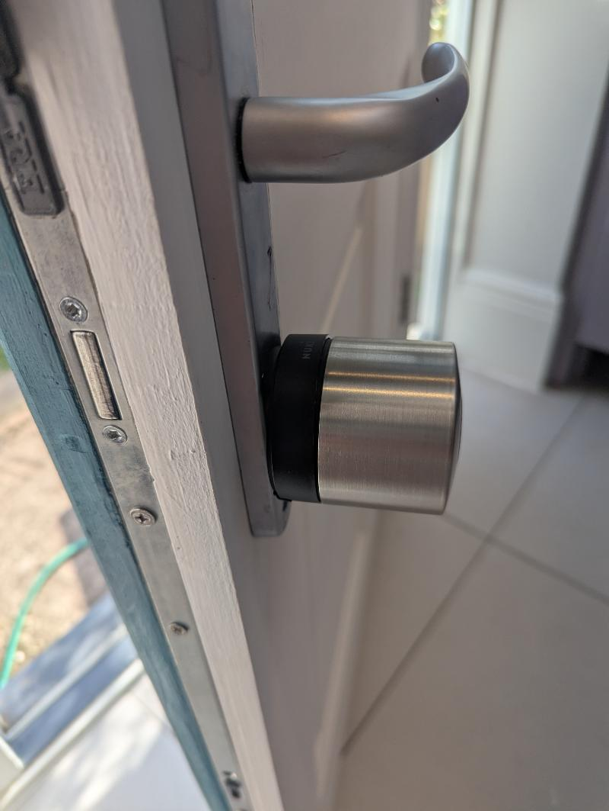
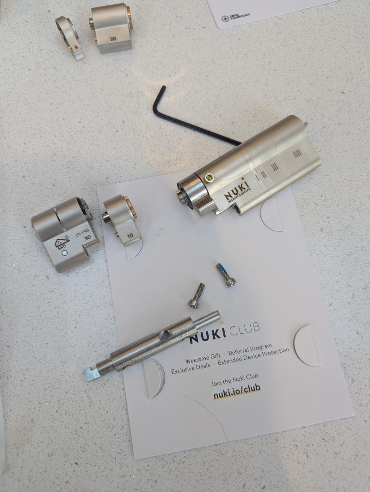
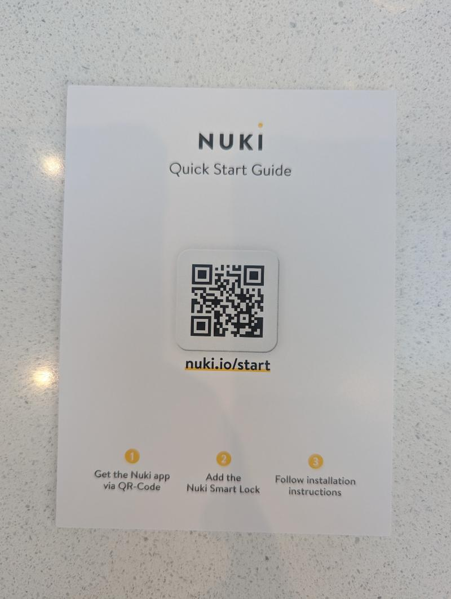
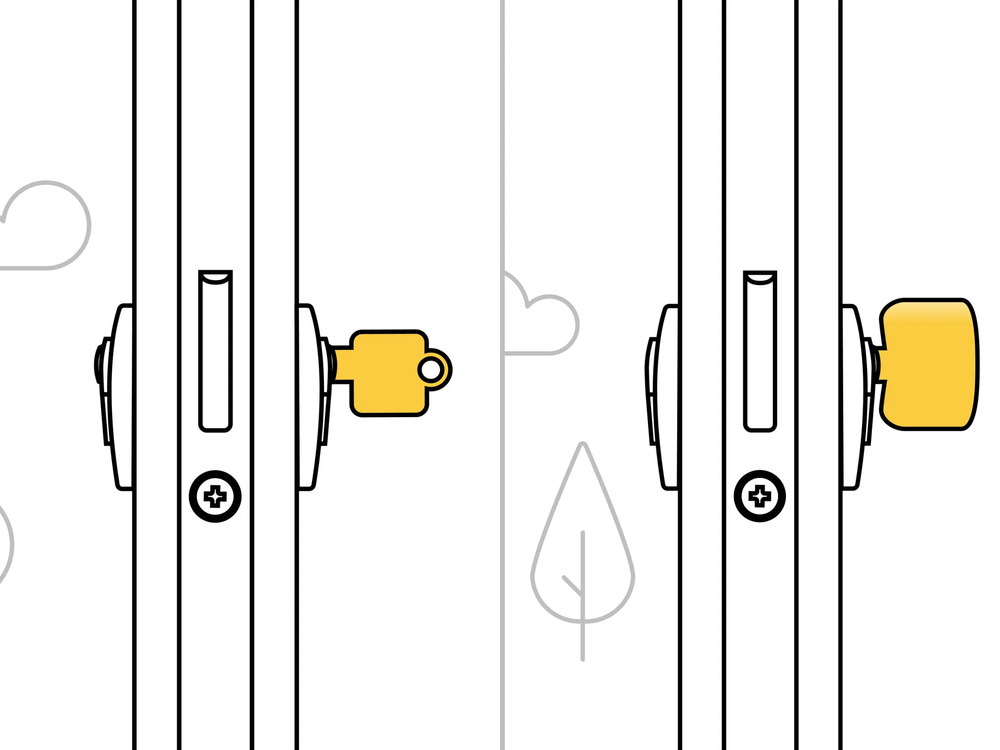
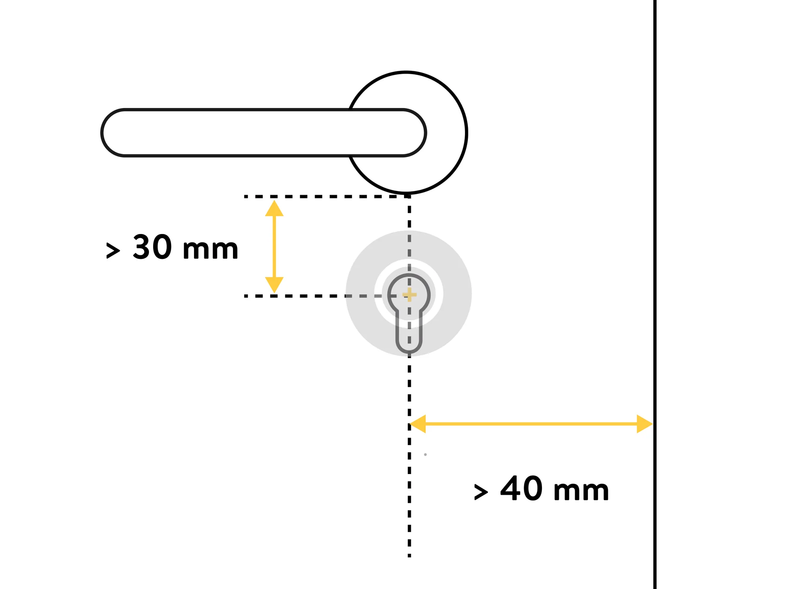
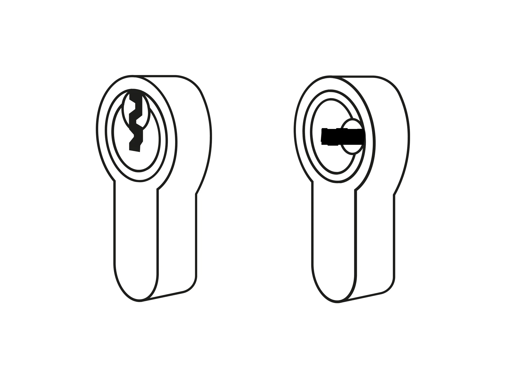
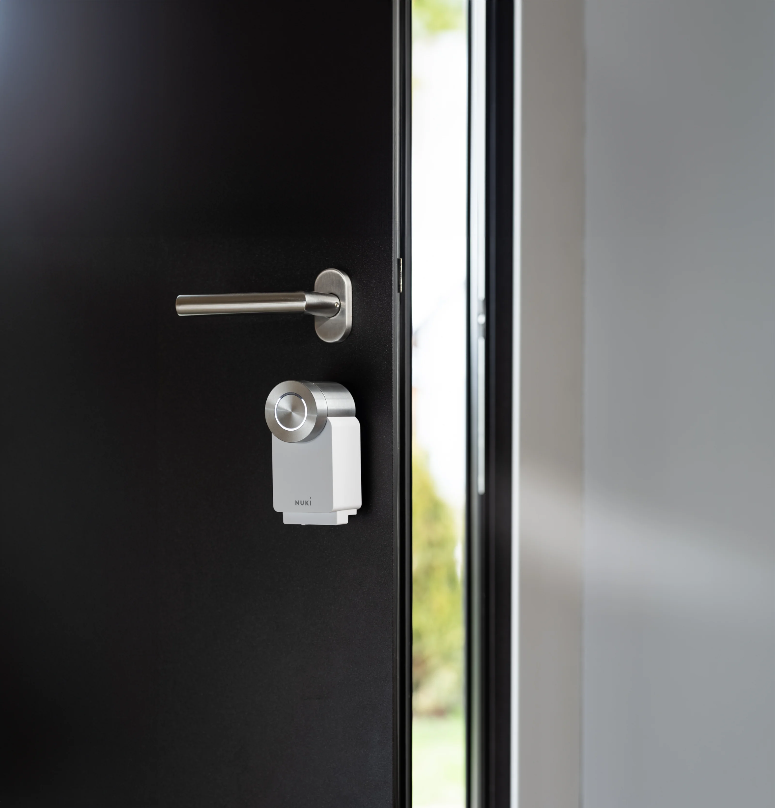

# Visual Reference - Diagrams & Photos

Images that explain what all the jargon actually means.

---

## Lock Types Comparison

### What's the Difference?

| Lock Type | Image | Where Used | Nuki Compatible? |
|-----------|-------|------------|------------------|
| **US Deadbolt** |  | USA, Canada | ✅ Smart Lock (US) |
| **Euro Cylinder** |  | Europe, SEA | ✅ Smart Lock Pro |
| **Lockwood 001 Rim Lock** |  | Australia | ❌ NOT COMPATIBLE |

### The Australian Problem: Lockwood 001

**This is NOT a cylinder** - it's a surface-mounted rim lock. Nuki cannot attach to this.
- Most common residential lock in Australia (~60%)
- Surface-mounted on inside of door
- Has a snib (small twist), not a thumbturn
- **Solution**: Replace with euro cylinder mortise lock, OR use alternative smart lock

---

## Nuki Installation - How It Works

### Exploded View (What Goes Where)

Shows:
- Motor unit (the main Nuki body)
- Mounting plate (attaches to door)
- Adapter (connects to your cylinder)

### Pro Model Explosion

Shows how the components fit together.

### Before & After

| Before | After |
|--------|-------|
|  |  |
| Existing euro cylinder with key | Nuki Smart Lock mounted over cylinder |

### Cylinder Assembly

Shows how the cylinder and Nuki connect.

### What's in the Box

All the pieces you get with Nuki Ultra.

---

## Compatibility Diagrams

### What You Need to Check

The key measurements to verify before buying.

### Cylinder Types

**This is the important one** - shows different cylinder types:
- Euro cylinder (drop shape) ✅
- Knob cylinder ✅ (with adapter)
- Round cylinder ⚠️ (check fit)

### Door Measurements

| Inward Opening | Outward Opening |
|----------------|-----------------|
|  |  |
| Min clearances for doors opening inward | Min clearances for doors opening outward |

### Key Orientation

How your key should sit when the door is locked/unlocked.

---

## Adapters Visual Reference

### All 8 Knob Adapters

The color-coded adapters for European cylinders. Match your cylinder brand to the adapter color.

See [../images/](../images/) for individual adapter photos.

---

## Smart Lock on Door

What it looks like installed - clean, minimal, sits over your existing door hardware.

---

## Image Provenance (Sources)

### Official Nuki Images (media.crystallize.com)

| File | Source URL | License |
|------|------------|---------|
| `nuki-installation-exploded.webp` | https://media.crystallize.com/nuki-production/24/6/18/13/@3200/nuki-smart-lock_installation.webp | Nuki - Editorial use |
| `nuki-pro-explosion.webp` | https://media.crystallize.com/nuki-production/25/12/10/2/@1920/20250128_pro-explosion-animation_still-001-4-3-1.webp | Nuki - Editorial use |
| `knob-adapters-all.webp` | https://media.crystallize.com/nuki-production/24/12/2/143/@3200/knob-adapters.webp | Nuki - Editorial use |
| `cylinder-types.webp` | https://media.crystallize.com/nuki-production/25/11/4/17/@1920/compatibility_nuki_smartlock_go_cylinder_types.webp | Nuki - Editorial use |
| `compatibility-requirements.webp` | https://media.crystallize.com/nuki-production/25/11/4/16/@1920/compatibility_nuki_smartlock_go_requirements.webp | Nuki - Editorial use |
| `dimensions-inwards.webp` | https://media.crystallize.com/nuki-production/25/11/4/10/@1920/compatibility_nuki_smartlock_dimensions_inwards.webp | Nuki - Editorial use |
| `dimensions-outwards.webp` | https://media.crystallize.com/nuki-production/25/11/4/10/@1920/compatibility_nuki_smartlock_dimensions_outwards.webp | Nuki - Editorial use |
| `key-orientation.webp` | https://media.crystallize.com/nuki-production/25/11/4/8/@1920/compatibility_nuki_smartlock_key_orientation.webp | Nuki - Editorial use |
| `compatibility-hero.webp` | https://media.crystallize.com/nuki-production/25/11/4/15/@1920/compatibility_nuki_smartlock_go_hero.webp | Nuki - Editorial use |
| `nuki-us-smart-lock.png` | https://media.crystallize.com/nuki-production/25/5/21/10/nuki_smart-lock_us.png | Nuki - Editorial use |
| `smart-lock-on-door.webp` | https://media.crystallize.com/nuki-production/24/6/20/5/@3200/smart-lock-pro-black-door-open.webp | Nuki - Editorial use |

### Third-Party Review Images (Yorkshire Wonders)

| File | Source URL | License |
|------|------------|---------|
| `installation-before-yale.jpg` | https://yorkshirewonders.co.uk/wp-content/uploads/2025/03/Nuki-Smart-Lock-Ultra-Review-5.jpg | Review - Fair use |
| `installation-after-mounted.jpg` | https://yorkshirewonders.co.uk/wp-content/uploads/2025/03/Nuki-Smart-Lock-Ultra-Review-36.jpg | Review - Fair use |
| `cylinder-assembly.jpg` | https://yorkshirewonders.co.uk/wp-content/uploads/2025/03/Nuki-Smart-Lock-Ultra-Review-28.jpg | Review - Fair use |
| `unboxed-components.jpg` | https://yorkshirewonders.co.uk/wp-content/uploads/2025/03/Nuki-Smart-Lock-Ultra-Review-13.jpg | Review - Fair use |

Source: [Yorkshire Wonders Nuki Smart Lock Ultra Review](https://yorkshirewonders.co.uk/nuki-smart-lock-ultra-keypad-2-review)

### Manufacturer Images (ASSA ABLOY / Lockwood)

| File | Source URL | License |
|------|------------|---------|
| `lockwood-001-rimlock.jpg` | https://gw-assets.assaabloy.com/is/image/assaabloy/268dd-130304035740603 | ASSA ABLOY - Product image |

Source: [Lockwood 001 Double Cylinder Deadlatch](https://www.lockweb.com.au/au/en/products/door-locks/rimlocks/001-double-cylinder-deadlatch)

---

## See Also

- [Adapters Guide](../) - Main adapters documentation
- [Adapter Images](../images/) - Color-coded adapter photos
- [3D Models](../3d/) - Printable adapters
- [Asia/Australia Gaps](../ASIA-AUSTRALIA-GAPS/) - Market analysis

---

*Last Updated: January 2026*
