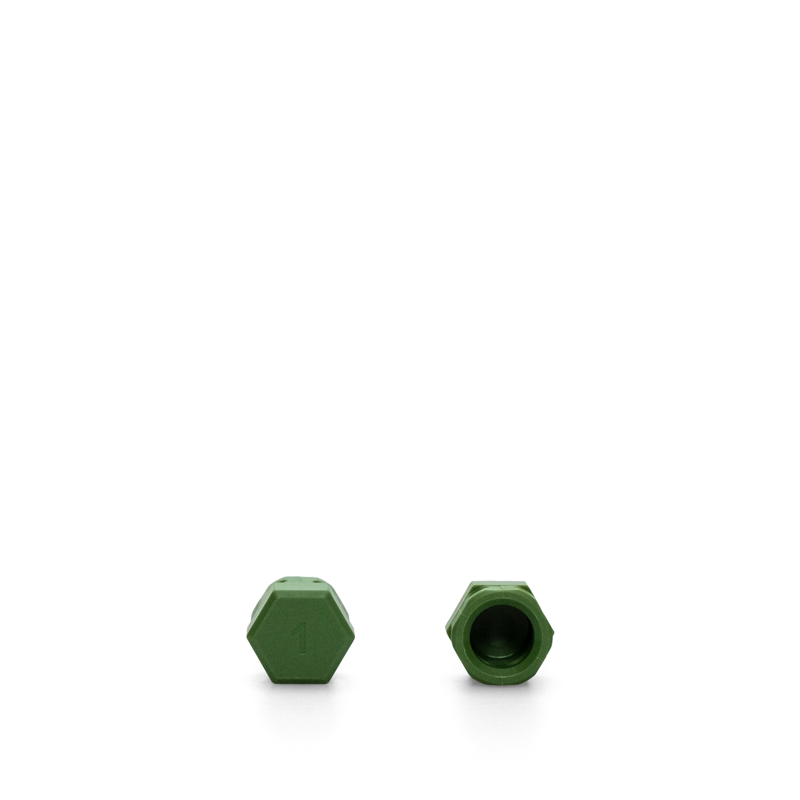

# Green Adapter - CES / EVVA

**Color**: Green
**Fits**: CES, EVVA cylinders
**Nuki Model**: Smart Lock Pro / Go / Ultra

---

## Product Image

---

## Cylinder Brands

| Brand | Origin | Notes |
|-------|--------|-------|
| **EVVA** | Austria | Austrian manufacturer (Nuki's home country) |
| **CES** | Germany | German brand |

---

## Countries Where Common

| Country | Usage | Notes |
|---------|-------|-------|
| **Austria** | Very High | EVVA is Austrian |
| **Germany** | High | Both brands common |
| **Switzerland** | Medium | EVVA used |

---

## Where to Buy

| Source | Link | Price |
|--------|------|-------|
| **Nuki Shop** | [nuki.io/adapters](https://nuki.io/en-at/products/spare-parts/adapter-smart-locks) | ~€10 |

---

## Image Provenance

| File | Source |
|------|--------|
| `adapter-green-evva.webp` | https://media.crystallize.com/nuki-production/24/12/3/46/@1920/nuki_knob-adapter1.webp |

---

## See Also

- [All Adapter Types](../README.md)
- [Austria Guide](../../countries/austria/)
- [Germany Guide](../../countries/germany/)
