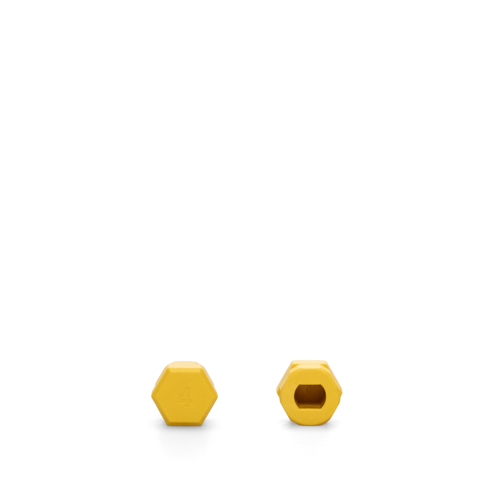

# Yellow Adapter - Dormakaba / Kaba

**Color**: Yellow
**Fits**: Dormakaba, Kaba cylinders
**Nuki Model**: Smart Lock Pro / Go / Ultra

---

## Product Image

---

## Cylinder Brands

| Brand | Sub-brands | Notes |
|-------|------------|-------|
| **Dormakaba** | - | German, merged with Kaba |
| **Kaba** | - | Swiss, now part of Dormakaba |

---

## Countries Where Common

| Country | Usage | Notes |
|---------|-------|-------|
| **Switzerland** | Very High | Kaba is Swiss |
| **Germany** | High | Commercial standard |
| **Singapore** | High | Commercial buildings |
| **Malaysia** | High | Commercial, condos |
| **Hong Kong** | High | Commercial |
| **Thailand** | Medium | Commercial |

---

## Where to Buy

| Source | Link | Price |
|--------|------|-------|
| **Nuki Shop** | [nuki.io/adapters](https://nuki.io/en-at/products/spare-parts/adapter-smart-locks) | ~€10 |

---

## 3D Print Alternative

If official adapter doesn't fit perfectly, see [3d/](3d/) for printable alternatives.

---

## Installation Notes

1. Ensure cylinder knob is clean
2. Slide adapter onto knob
3. Adapter should fit snugly
4. If loose, try different adapter or add shim

---

## Image Provenance

| File | Source |
|------|--------|
| `adapter-yellow-dormakaba.webp` | https://media.crystallize.com/nuki-production/24/12/3/47/@1920/nuki_knob-adapter4.webp |

---

## See Also

- [All Adapter Types](../)
- [Switzerland Guide](../../countries/switzerland/)
- [Singapore Guide](../../countries/singapore/)
